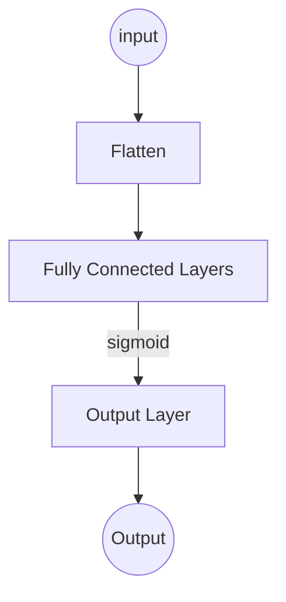
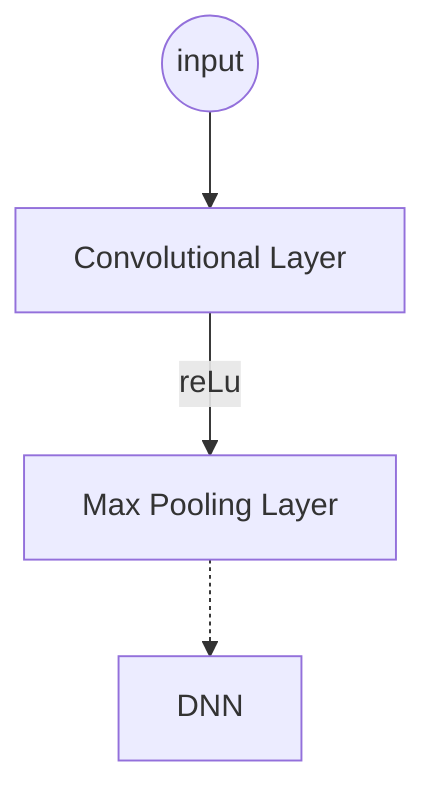
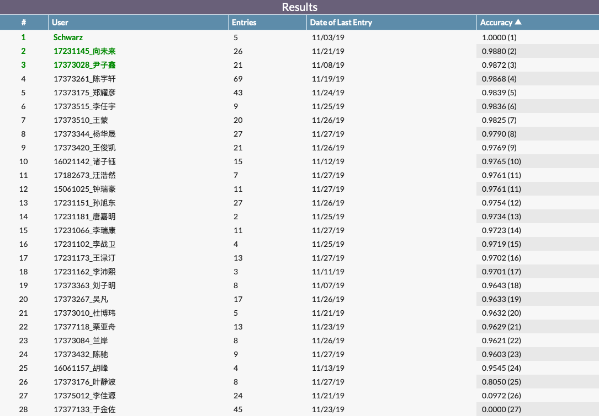

[toc]

本项目使用 Matlab 面向对象及其底层功能实现了一个简单的卷积神经网络框架，并使用 Kannada 语手写数字数据集对其进行了测试。测试分为两个阶段进行，差别仅在于是否使用卷积层进行训练。为了便于说明，本文将不包含卷积层的部分框架称为**深度神经网络框架**（在实现时确实首先实现了此框架），反之称为**卷积神经网络框架**。与之对应，使用 Keras 训练的神经网络模型则直接称之为**框架模型**，另外两个模型分别称为**浅层神经网络模型**（尽管使用深度神经网络框架进行搭建）以及**卷积神经网络模型**。作为对照，本项目同时使用了 Keras 在相同数据集上进行测试。

项目源码使用 [GitHub](https://github.com/LutingWang/MachineLearning) 托管，读者可以直接通过超链接访问。本文主要介绍项目的实现方式和训练过程，相关公式推导不会涉及。如果代码中出现了难以理解的公式或符号，可以查看作者的 [CSDN](https://blog.csdn.net/LutingWang/article/details/97146435) 博客。

# 使用方法介绍与实现细节

本文附带源码中包含全部三个模型的源代码。其中 `keras` 目录下是使用 Keras 开源框架搭建的卷积神经网络模型。 `convolutional` 目录下包含卷积神经网络框架的底层实现，深度神经网络框架是卷积神经网络框架的前身，也已经包含在其实现当中。由于源代码所需数据太大，无法通过邮件方式发送，读者可以前往 GitHub 下载。

## Keras 开源框架

Keras 是一个 Python 编写的开源神经网络框架，可以作为 Tensorflow 等高阶应用程序接口。使用 Keras 可以在很大程度上降低研发网络模型的时间成本。本文搭建的神经网络模型仅用到了 Keras 的卷积神经网络部分，除此之外 Keras 还支持循环神经网络的设计。使用 Keras 训练的网络可以轻松在测试集上达到 $97\%$ 的正确率。

使用开源框架进行训练相对简单，大体可以分为以下几步

1. 读取数据并进行预处理
2. 搭建网络模型
3. 将数据输入网络模型进行训练
4. 将训练后的网络模型用于新数据的预测

其中每一步都只需用非常简单的代码完成，读者可以查看 `keras` 目录下的 Python 源代码。

## DNN

作为卷积神经网络的基础，本文首先使用 Matlab 编写了深度神经网络框架。框架支持的网络结构如下



尽管框架可以训练具有任意多层的深度网络，但是由于 bp 算法导致的梯度消失等问题，本框架下训练效果最好的还是浅层神经网络。保存在 `convolutional/fullyconnected.mat` 文件中的网络模型 `fc` 可以在测试集上达到 $89.5\%$ 的准确率。

深度神经网络框架包括顶层类 `NeuralNetwork` 和 `Layer` 分别用于描述神经网络和网络中各层。考虑到向卷积神经网络的扩展功能，在深度神经网络框架中还引入了 `ComputationalLayer` 作为所有存储了参数的层的超类。在本节中，只有全连接层 `FullyConnected` 继承自 `ComputationalLayer` ，其他各层均直接继承自 `Layer` 。


首先从深度神经网络的核心 `FullyConnected` 开始介绍。全连接层的输入和输出都是一维向量，参数是一个二维矩阵。创建时 `FullyConnected` 会自动在 $(-1, 1)$ 之间初始化参数。全连接层类内部还实现了 `Layer` 所定义的两个接口：前向传播和反向传播。前向传播时，当前层根据来自上一层的输入和存储的参数计算出对应的输出，并借由 `NeuralNetwork` 传递给下一层。反向传播时，当前层根据下一层反向传播回来的误差向量以及部分存储信息计算出传向前一层的误差向量，与此同时更新当前层的参数。

除全连接层以外，深度神经网络中 `Flatten` 层和 `Output` 层分别代表输入层和输出层。输入层的功能较为简单，只需要将输入的图片转化为可以被全连接层读取的一维向量即可。用 Matlab 代码实现如下

```matlab
output = reshape(input, obj.inputSize ^ 2 * obj.inputLayers, size(input, 4));
```

输出层的本意是实现 SoftMax 效果，但是由于全连接层本身的激活函数就是 sigmoid ，所以 `Output` 层的前向传播仅仅是将输出向量归一化。用 Matlab 代码实现如下

```matlab
output = input ./ repmat(sum(input), obj.inputSize, 1);
```

与输入层不同，输出层是反向传播的起点。即使输出层本身并没有参数，但仍然需要实现反向传播函数。本文使用的代价函数是 $l_2$ 正则化的交叉熵，所以在输出层的反向传播实现上较为简单

```matlab
delta = obj.input - labels;
```

最后 `NeuralNetwork` 可以根据用户指定的层次顺序构造出一个神经网络，并自动添加输出层。举例来说，可以用以下语句创建一个神经网络

```matlab
nn = NeuralNetwork({ ...
				Flatten(false, 28, 1), ...
				FullyConnected(false, 784, 30), ...
				FullyConnected(true, 30, 10) ...
				});
```

训练时，可以同时指定批次大小和迭代次数

```matlab
nn.train(X_train_bin, Y_train, 100, 50)；
```

为了降低框架的复杂性，步长和正则化惩罚系数被定义在 `Layer` 的静态属性中。每次训练前可以进行更改，使模型分批次以不同参数训练，提高训练的灵活性。

## CNN

卷积神经网络广泛应用于计算机视觉领域。在深度神经网络的基础上，只需要新增卷积层和池化层即可完成。一般的卷积网络结构如下



保存在 `convolutional/convolutional.mat` 文件中的 `cv` 网络模型在测试集上达到了 $90\%$ 的准确率。

相比深度神经网络，卷积神经网络的特点在于卷积层和池化层。相应 UML 如下


由于池化层不包含参数，因此直接继承了 `Layer` 。而 `Convolutional` 需要存储参数并对参数进行更新，所以他是 `ComputationalLayer` 的子类。尽管这两个类是卷积神经网络所特有的，但是他们的兄弟类已经在深度神经网络一节中被详细介绍了，因此此处不会详细说明其技术细节。

不过值得一提的是网络的计算效率问题。尽管我们的输入都是二维图片，但是卷积层中可能包含多个卷积核，因此对于一般的情况还是需要假设卷积层的输入是一个多通道图片。与此同时，我们的神经网络需要支持 minibatch 机制，因此卷积层之间传递的是一个四维矩阵 $s \times s \times c \times m$ 。

再来看卷积层的参数。一个卷积核需要同时处理输入的所有通道，因此至少是三维的。而每个卷积核又只能对应一个输出通道，所以卷积层的参数也是一个四维矩阵。由于卷积操作的特殊性，这里我们无法调用 Matlab 内置的 `convn` 函数，只能对全部样本进行遍历。这意味着无论 minibatch 的大小设置为多少，一个 epoch 都至少要执行 $60000$ 次循环。对于池化层，循环内部的操作更加复杂。

正因如此，本框架放弃了表现效果更好的 `MaxPooling` ，而是实现了较为快速的 `AveragePooling` 。训练过程中也尽量减少卷积和池化的操作次数。这在一定程度上牺牲了准确率，以换得效率上的提升。

## 数据预处理与参数初始化

输入图片是 $28 \times 28$ 的灰度图像，图像中每个像素都用 $0 \sim 255$ 的光度值来表示。但是通过可视化部分样本可以发现，光度值的具体大小对于图像显示没有很大区别。同时，在同一片亮色区域可能有光度波动，这样的噪声可能会影响模型的学习效果。因此，训练前首先将亮色区域设置为 $1$ ，其他区域设置为 $0$ 。使用 Matlab 实现如下

```matlab
X_train_bin = X_train > 20;
```

这样原始图像就被压缩成一个 01 矩阵。为了使输入输出以及参数在数量级上大致相当，取参数的初始值范围在 $(-1, 1)$ 之间，以加速训练过程。

# 模型结构

本文共涉及三个神经网络模型，下面首先列出其创建语句

1. Keras 框架模型

```python
model = keras.models.Sequential()
model.add(keras.layers.Conv2D(32, (5, 5), input_shape = (28, 28, 1), activation = 'relu'))
model.add(keras.layers.MaxPooling2D(pool_size = (2, 2)))
model.add(keras.layers.Dropout(0.2))
model.add(keras.layers.Flatten())
model.add(keras.layers.Dense(units = 128, activation = 'relu'))
model.add(keras.layers.Dense(units = 10, activation = 'softmax'))
model.compile(loss = 'categorical_crossentropy', optimizer = 'adam', metrics = ['accuracy'])
```

2. 浅层神经网络模型

```matlab
fc = NeuralNetwork({ ...
				Flatten(false, 28, 1), ...
				FullyConnected(false, 784, 30), ...
				FullyConnected(true, 30, 10) ...
				});
```

3. 卷积神经网络模型

```matlab
cv = NeuralNetwork({ ...
				Convolutional(false, 3, 1, 5), ...
				AveragePooling(false, 2), ...
				Flatten(false, 13, 5), ...
				FullyConnected(false, 13 ^ 2 * 5, 30), ...
				FullyConnected(true, 30, 10) ...
				})
```

代码的含义都比较明显。其中最复杂的模型是框架模型，卷积神经网络框架次之，浅层神经网络模型最简单。这样设计是考虑到开源框架可以自动处理调参过程，同时运行效率较高；而底层实现的神经网络框架在运算速度和准确率上都比不上 Keras ，因此只用简单模型加以测试。下面对比一下各个模型的参数个数

| 模型名称         | 卷积层参数     | 全连接层参数                     | 输出层参数           | 总参数个数 |
| ---------------- | -------------- | -------------------------------- | -------------------- | ---------- |
| Keras 框架模型   | $32 \times 25$ | $32 \times 144 \times 128 + 128$ | $128 \times 10 + 10$ | $592,042$  |
| 卷积神经网络模型 | $5 \times 9$   | $5 \times 169 \times 30 + 30$    | $30 \times 10 + 10$  | $25,755$   |
| 浅层神经网络模型 | $0$            | $784 \times 30 + 30$             | $30 \times 10 + 10$  | $23,880$   |

可以看出，框架模型的参数量几乎是后两个模型参数个数的 $20$ 倍，具有更好的准确率也是自然。只看后两个模型的话，卷积神经网络的参数较浅层神经网络增加了近 $10 \%$ ，而从准确率来看卷积神经网络从浅层神经网络的 $89 \%$ 提升到了 $90 \%$ ，也几乎减小了误差的 $10 \%$ 。由此推测，准确率的提升很可能是增加参数的结果，而非新增卷积层的作用。

不过在训练过程中的另一个发现是，增加卷积层的确会显著降低模型的训练速度，但却在另一方面加快了收敛速度。在相同的训练时间下，浅层神经网络可以训练 $1000$ 个 epoch 左右，而卷积神经网络却仅仅完成了 $10$ 余个 epoch ；不过这时对模型进行检验会发现，二者在训练集上达到了相近的准确率。这说明，新增卷积层确实可以加快模型的学习速度，进而增加准确率。

限于硬件计算能力和时间关系，本文没有对更多网络结构作出尝试。

# 调参过程

Keras 框架自带调参功能，此处主要说明后两个模型的调参过程。从上面的讨论可以看出，模型一共包含五个参数，分别是

| 参数       | 功能                           |
| ---------- | ------------------------------ |
| $\epsilon$ | 限制网络中每个参数初始值的大小 |
| $\alpha$   | 反向传播梯度下降学习率         |
| $\lambda$  | 正则化惩罚项系数               |
| batchSize  | 训练批次大小                   |
| epochs     | 单次训练样本集迭代次数         |

基于本文的实现，模型训练可以分段进行，因此 batchSize 和 epochs 这两个参数几乎与模型训练效果无关（即使一次训练过程中 batchSize 大小导致了训练效果不理想，后续还可以通过增加训练次数来弥补）。而 $\epsilon$ 只用于模型初始化，且其设置在前文中已经讨论过，因此也不在调参范围内。这样来看，实际对模型构成影响的只有 $\alpha$ 和 $\lambda$ 两项。

现在假设模型的实现是正确的，也就是说不存在结构上的致命错误。本文的调参过程如下

1. 将 $\alpha$ 和 $\lambda$ 调到初始值
2. 对样本进行少量训练
3. 使用模型对训练样本进行预测，记录 confidence 和 accuracy
4. 如果 confidence 或 accuracy 有少许提升，则根据提升幅度增大训练量，并重复第 3 步；否则对 $\alpha$ 或 $\lambda$ 进行修改，并重复第二步

对于上述过程有几点需要说明。首先样本的训练量是依赖于模型的。一般来说卷积神经网络每次最多训练 $5$ 个 epoch 。过多的训练量不仅会消耗很长时间，而且会放大梯度爆炸的影响，使模型参数变化范围超过其调节范围。这类似于超过模型的弹性限度，此时模型就无法再用于后续训练了。而单纯的深度网络则可以一次训练 $20 \sim 50$ 个 epoch 。具体的原因还不能确定，但笔者猜测这与卷积神经网络的参数共享有关，因为共享的参数一旦发生变化将影响整个输入图片。

其次 $\alpha$ 和 $\lambda$ 的初始值依赖于训练量。如前所述，过大的 $\alpha$ 和 $\lambda$ 同样会导致梯度爆炸。因此对于卷积神经网络一般设置初始值为 $0.05$ 和 $0.005$ ，而对于普通深度网络则需要减小一个数量级。这个数值是在进行过多次调整后由经验确定的，对于不同的模型可能也有所出入。但在缺乏先验知识的情况下，这组数值可能是一个很好的开头。

另外，训练样本时记录的 confidence 和 accuracy 分别表示预测的置信度和准确率。其中置信度完全由模型生成，即将全部测试样本输入模型后得到的输出。而准确率则需要根据预测结果和实际标签比对生成。一般来说，准确率可以比较好的反应模型预测效果有没有提升。但是一旦发生过拟合，单纯追求准确率可能会陷入恶性循环。因此比较好的做法是检查几个样本的置信度变化，这些样本一般是前次训练效果不理想的点。如果某次训练使这些样本的置信度有所提升，那么可以放心的使用当前参数进行大量样本训练。否则需要检查整体准确率是否提升，因为又看抽取的样本恰好没有明显变化。如果准确率有上升，则需要视情况继续训练或更改参数。

最后，修改参数值的经验是先减小正则化系数，如果无效再减小步长，最后增加训练量。实际调参过程中，很少会遇到增大 $\alpha$ 或 $\lambda$ 的情况（只有在准确率持续小幅增长时才会考虑）。比较常见的情况是准确率增幅越来越慢，且渐进趋势不令人满意。这种情况一般要先考虑减小正则化系数。因为增幅减慢仍然处于增长状态，所以一般不是因为步长过大。而正则化系数过大则确实会降低模型预测能力的上界。为了避免由正则化引入的精度损失，调参首选应该是减小正则化系数。

如果训练到网络接近饱和时，之前减小的步长可能使训练速度进一步变慢，因此这时可以选择逐渐增大步长。如果希望预防过拟合也可以同步增大惩罚项系数。以卷积神经网络的调参过程为例，参数大小的变化如下

| 编号 | 学习率 $\alpha$ | 惩罚项系数 $\lambda$ |
| :--: | --------------- | -------------------- |
|  1   | 0.05            | 0.005                |
|  2   | 0.05            | 0.001                |
|  3   | 0.05            | 0.0005               |
|  4   | 0.01            | 0.0005               |
|  5   | 0.01            | 0.0003               |
|  6   | 0.005           | 0.0003               |
|  7   | 0.008           | 0.0003               |
|  8   | 0.01            | 0.0005               |

表中的每次调整可能对应多次训练，每次训练也可能包含不同的迭代次数。因此表中数据仅作为说明。

# 问题及解决方法

本文所述问题可以大致分为三个层次

1. 框架级：神经网络框架的代码实现有误
2. 模型级：使用框架构造出的模型有误
3. 训练级：训练模型时的调参方法不当

本节将按次序说明遇到的问题以及相应的查错和解决方法。

## 计算公式输入错误

第一次遇到这个错误是在深度学习框架刚刚编写完成时。为了检验框架是否正常工作，笔者随机生成了一组测试样例。样例输入为一个二维点坐标，标准输出为该点所属象限。理论上说这是一个非常简单的分类任务，不需要太多的训练次数。但是当时的模型在训练 $5$ 个 epoch 后返回了全 $1$ 的结果，意味着网络完全没有进行学习。

查看权重矩阵发现矩阵中每个元素都相等，但随机初始化权重的函数已经通过了单元测试，因此将错误定位到前向传播和反向传播。在输出层设置断点发现，前一层的输出非常随机，而且有些值会超过 $1$ 。但是输出层的前层为全连接层，其输出应在 $(0, 1)$ 之间。再检查全连接层的前向传播函数时，发现没有对神经元状态进行激活。

在修改了前向传播公式后，重新进行测试发现，网络的输出仅仅是复现上一个训练样本的标签。最初的想法是学习率过大导致单个样本造成的权重波动，但是减小学习率后还是没有改观。再次查看权重矩阵发现，矩阵中元素的差距不大，但是每次更新都会使其中某个元素超过同一行中的其他值。这个现象原本是正常的，但问题在于权重的增长不能被积累下来。而网络中可能导致权重减小的只有 $l_2$ 正则化，因此将惩罚项系数调整为 $0$ 。继续训练后，权重出现了爆炸性增长，进而怀疑反向传播过程出现了问题。仔细排查后，发现反向传播公式录入有误。修改正确后，模型成功在测试样例上达到了 $80\%$ 的正确率。

## 激活层是否存在造成的反向传播错误

为了便于实现，本文没有自动识别网络中某一层的前层是否包含激活函数。相反，这一信息需要通过用户提供。从反向传播公式可以看出，前一层是否包含激活函数会极大的影响反向传播得到的误差项大小。如果前一层确实经过了 sigmoid 激活，而反向传播时没有做相应乘法运算，则会导致错误。

某次训练卷积神经网络时，尽管模型在训练集上的准确率达到了 $80 \%$ ，但卷积层参数一度达到了 $10^{20}$ 这一数量级，而且随着训练进行还有增大的趋势。遇到这个问题，我的第一反应是正则化系数写错。因为正则化原本的作用是减小参数的绝对值，如果将其系数误写成相反数，则又可能导致参数不断增大。但是在仔细检查过正则化相关的所有代码后，我排除了这个错误的可能性。

于是，最有可能造成错误的就成了反向传播。我重新搭建了一个模型用于观察每一次反向传播的误差项大小。在前几次的计算中还没有显示出什么问题，但是当参数大小增加到一定程度后，我就发现全连接层向前传递的误差项开始显著增加。进一步设置断点跟踪后发现，原因在于全连接层不认为他的前层输出经过了激活。

这一问题很明显是网络初始化时的参数错误。再次查看初始化语句，发现其中一个参数被错误的传入了 `false` 。更正后便没有再出现参数过大的现象。

## 参数初始值不合适

训练过程中的错误往往没有前面所说的一些错误那么严重。一般来说，参数错误不会直接导致网络崩溃，但是却会对准确率造成影响。举例来说，在前几次对网络模型进行测试时，我会让模型以同样的参数训练很长时间再查看训练结果。在低维梯度下降中，这种方法往往是可行的，因为随着参数逐渐趋近最优解，相应梯度也会减小。尽管算法的步长没有改变，但实际上每次更新的幅度减小了。不过我没有考虑到，神经网络的代价函数过于复杂，步长太大很可能无法使模型收敛。在步长被设置的过大的情况下持续训练，只会浪费计算资源，同时还增大了模型崩溃的风险。

在经过了多次尝试后，我逐渐总结出了一个调参的流程（如上述）。其中，小批次训练主要是为了保证一旦步长超过模型收敛的要求时我可以及时发现；而调整参数值的方法则相当于一个宏观的梯度下降过程。

# 评测分数和排名



